## Flutter PH's UI Challenge

List of submissions from the community for the UI challenge hosted by Flutter PH. This does not include submissions that were submitted privately.

### August 2020
Theme: Food Delivery UI

[Read blog](https://medium.com/flutterphilippines/flutter-philippines-uichallenge-august-2020-d747b4cc38d)

<!--
TODO: Remove this soon

Important details:

1. Project and dev names
2. Link to a screenshot
3. Link/s to the project (only if public)
4. Tags, can be updated later

-->

|Pizza Delivery App by Joni Sindo|Food Delivery UI by Jose Jaime Bisuna|
|---|---|
|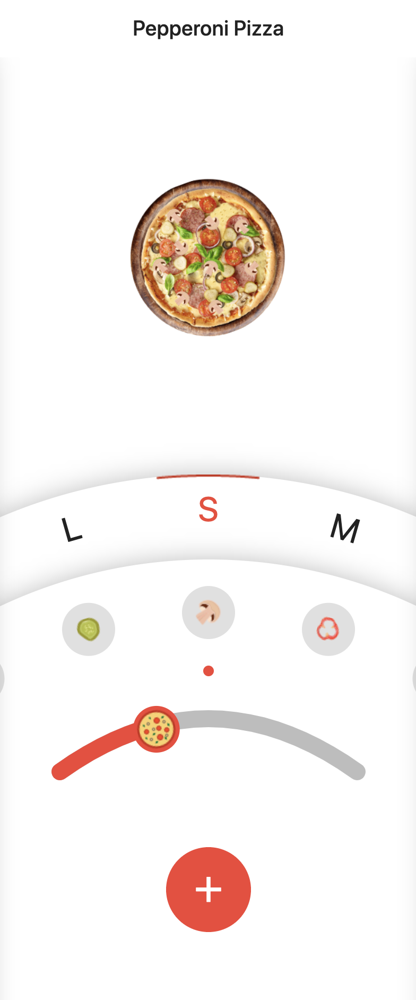|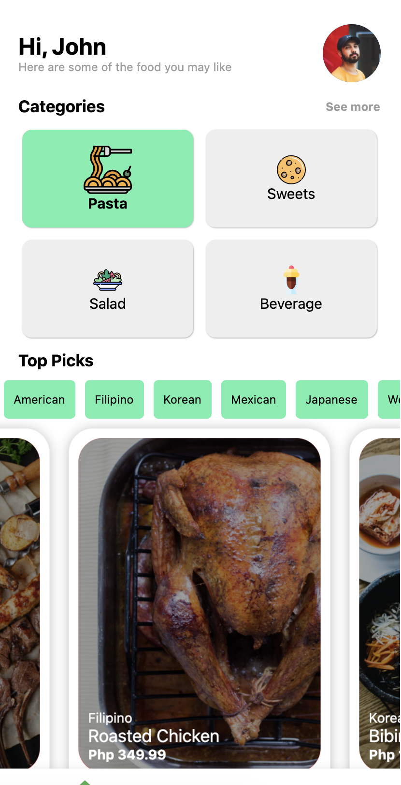|
|[Codepen](https://codepen.io/digitaljoni/pen/QWyXJZe), [Github](https://github.com/digitaljoni/examples_flutter/tree/master/pizza_delivery)|[Codepen](https://codepen.io/CambooBabbage/pen/VwaZPXp)|

<!-- Add other submissions here [Jansalvador1445] -->

|Footopia UI by Max Bryan Bauzon|Food Delivery App by Darryl Llanura|
|---|---|
|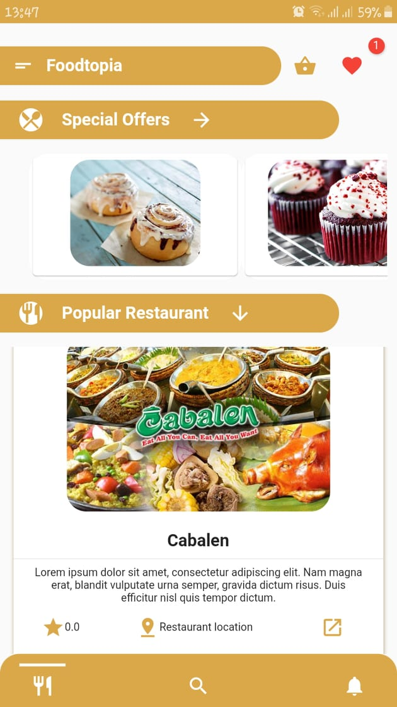|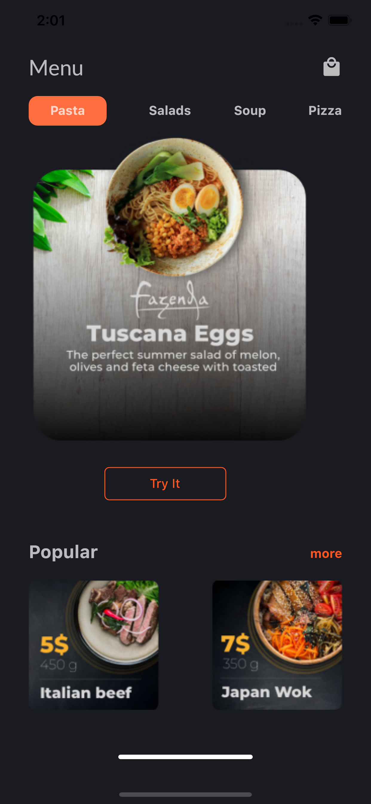|
|[Github](https://github.com/bryanbauzon/Food-Delivery-UI-Challlenge-Flutter), [Dribbble](https://dribbble.com/shots/5998580-Food-Delivery-App) | [Github](https://github.com/Ghost-017/flutter-food-delivery-ui-challange), [Dribbble](https://dribbble.com/shots/13538345-Food-Delivery-App)|

|Food Delivery UI by Debra Bula|Food Delivery UI by Gary Senoc|
|---|---|
|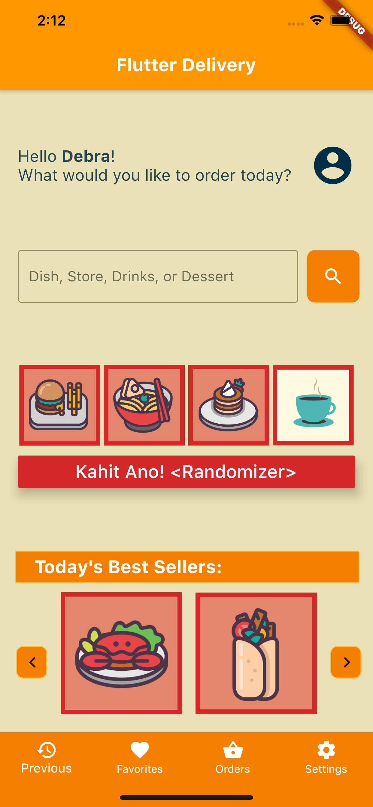|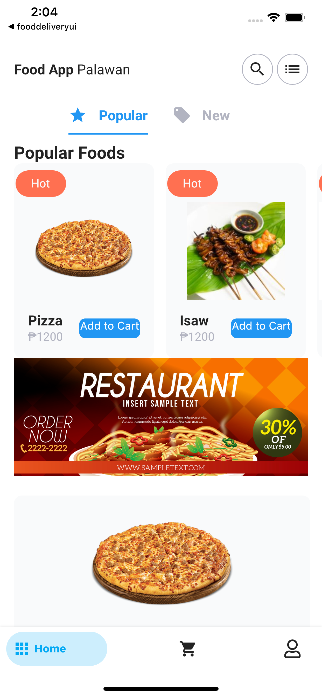|
|[Github](https://github.com/debbiedebz/flutterDelivery.git)|[Github](https://github.com/garysenoc/flutter_august_challenge)|

|Vertivent by Harvey Sison|Food Drive by Ian Jasper Santos|
|---|---|
|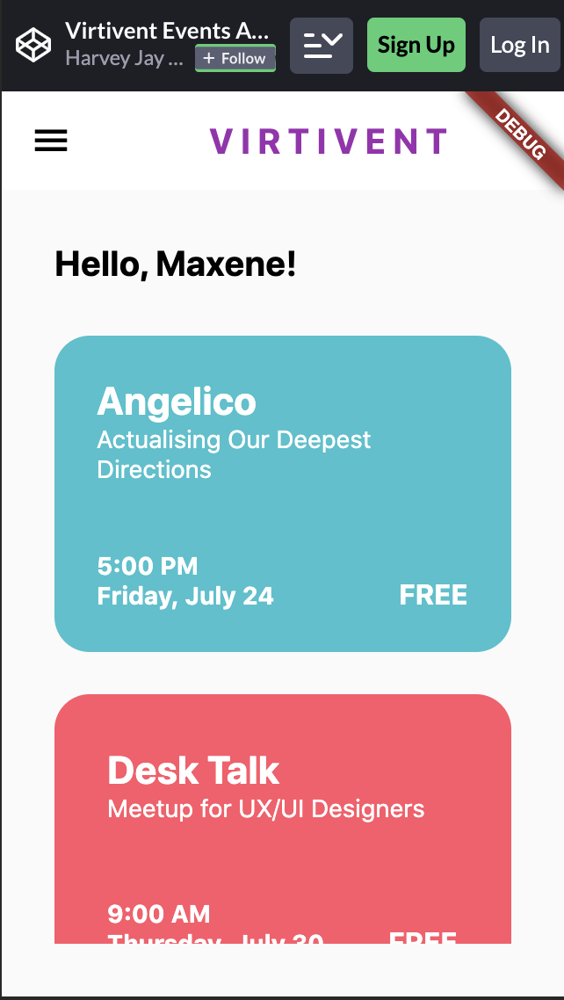|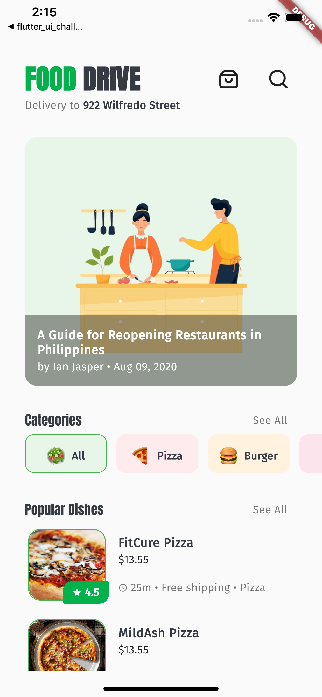|
|[Codepen](https://codepen.io/hjkun77/pen/dyGjBwJ)|[Github](https://github.com/ianjaspersantos/food_drive), [Flutter Web](https://ianjaspersantos.github.io/food-drive/)|

|Palengke by Ian Jasper Santos|GrabFood by Ian Jasper Santos|
|---|---|
|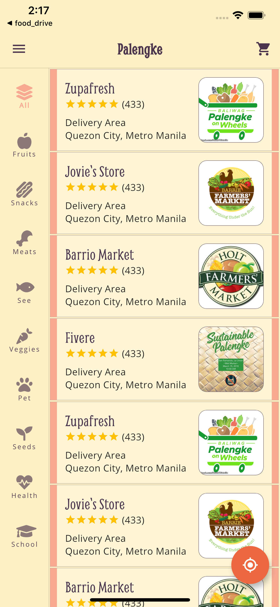|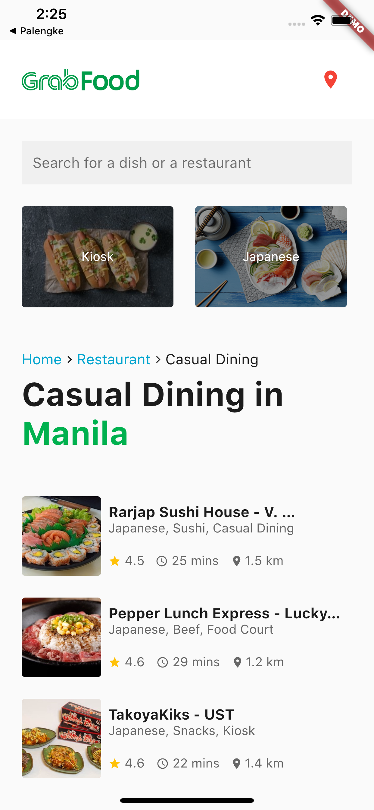|
|[Github](https://github.com/ianjaspersantos/palengke), [Flutter Web](https://ianjaspersantos.github.io/palengke/)|[Github](https://github.com/ianjaspersantos/grab_food_clone), [Flutter Web](https://ianjaspersantos.github.io/grab-food-clone/)|

|Food Delivery UI by Jan Salvador Sebastian|Daily Food by Jolo Castillo|
|---|---|
|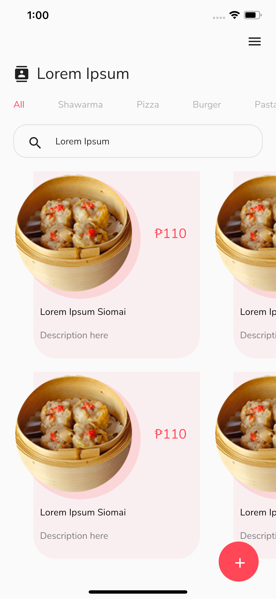|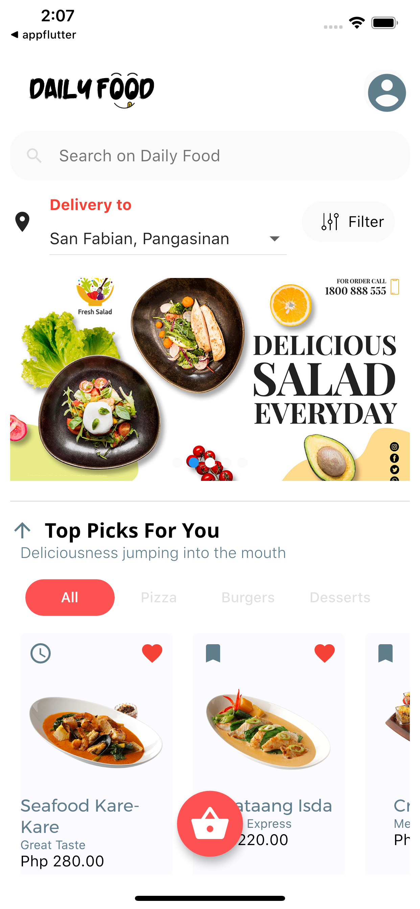|
|[Github](https://github.com/Jansalvador1445/flutterph_challenge_food_delivery)|[Github](https://github.com/thecodeplayer/Daily-Food)|

|Fastfood Delivery App by Jonathan Mayol|GrabFood by Nichole John Romero|
|---|---|
|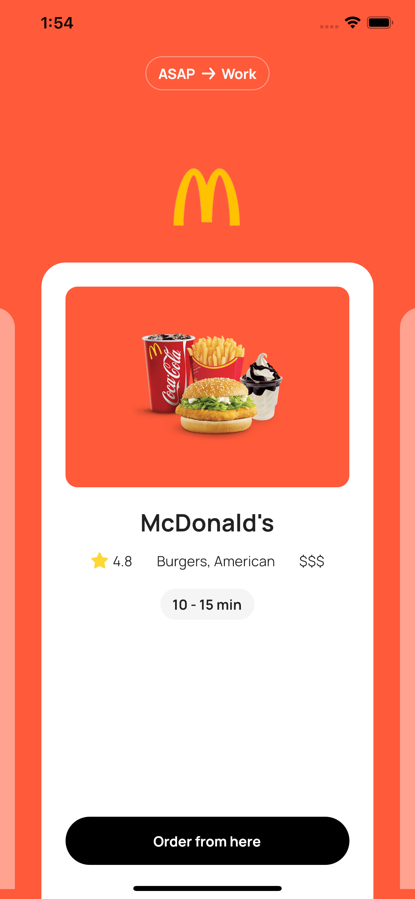||
|[Github](https://github.com/mayoljonathan/flutter_fast_food), [Flutter Web](https://mayoljonathan.com/flutter_fast_food_landing)|[Github](https://github.com/boringdeveloper/GrabFoodUI )|

|Pinoy Ready To Eat by Paul Valencia|
|---|
||
|[Github](https://github.com/i8out/pinoy-ready-to-eat-app)|